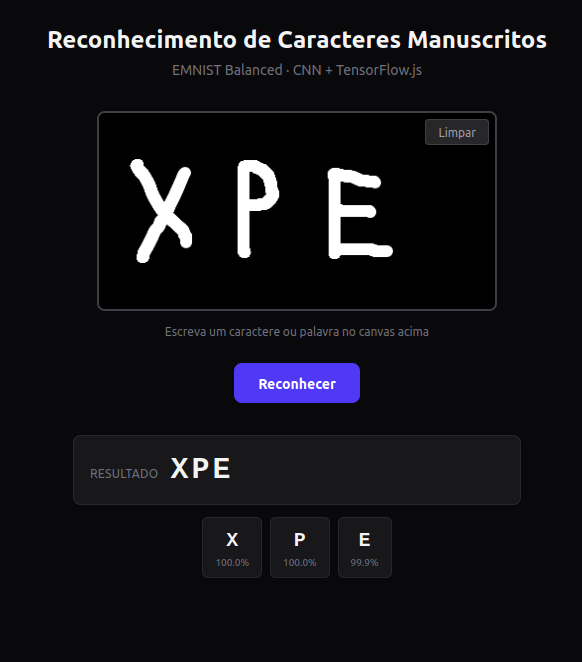

# Handwritten Character Recognition

Sistema de reconhecimento de caracteres manuscritos utilizando Rede Neural Convolucional (CNN) treinada sobre o dataset EMNIST, com interface web para predição em tempo real.



---

## Treinamento

### Ambiente de Execução

O treinamento foi realizado no **Google Colab** com acesso à GPU **NVIDIA T4**. A integração foi feita diretamente pelo **VS Code**, conectando o kernel remoto do Colab ao ambiente de desenvolvimento local.

A escolha pelo Colab se deu pela disponibilidade imediata de GPU sem necessidade de configuração local de CUDA/cuDNN, acelerando significativamente o ciclo de treino-evaluação.

### Download do Modelo

Como o Colab roda em um ambiente efêmero, o arquivo `emnist_model.keras` gerado após o treinamento é automaticamente baixado para a máquina local através de uma célula no final do notebook que dispara o download via navegador.

### Estrutura Modular

O código de treinamento foi modularizado em separação de responsabilidades:

```text
training/
├── main.ipynb          # Pipeline completo: treino, avaliação, exportação
├── config.py           # Hiperparâmetros, arquitetura e labels
├── libs/
│   ├── seeds.py        # Reprodutibilidade (env vars, seeds, determinismo)
│   ├── data_loader.py  # Download e pré-processamento do EMNIST
│   ├── model.py        # Construção da CNN e conversão para TF.js
│   ├── trainer.py      # Loop de treinamento com early stopping
│   └── evaluator.py    # Métricas, matriz de confusão, análise
├── models/             # Modelos .keras salvos (gitignored)
└── requirements.txt    # Dependências
```

### Hiperparâmetros

| Parâmetro         | Valor                |
|-------------------|----------------------|
| Otimizador        | Adam                 |
| Learning Rate     | 0.001                |
| Loss Function     | Categorical Cross-Entropy |
| Batch Size        | 128                  |
| Épocas Máximas    | 15                   |
| Early Stopping    | Paciência de 5 épocas |
| Validation Split  | 10%                  |

### Arquitetura da CNN

```text
Conv2D(32, 5x5, tanh, same) → MaxPool(2x2)
Conv2D(48, 5x5, tanh, same) → MaxPool(2x2)
Conv2D(64, 5x5, tanh, same)
Flatten
Dense(512, tanh)
Dense(84, tanh)
Dense(47, softmax)
```

Total de parâmetros treináveis: **1.769.375** (~6.75 MB)

### Resultados do Treinamento

| Métrica   | Valor  |
|-----------|--------|
| Accuracy  | 86,91% |
| Precision | 87,10% |
| Recall    | 86,91% |

O treinamento utilizou **15 épocas** com early stopping (paciência de 5 épocas). A melhor performance foi atingida na **época 9**, com restauração automática dos melhores pesos.

> **Nota:** Os valores acima referem-se a uma execução específica do treino. Como discutido na seção de Reprodutibilidade abaixo, valores podem variar entre execuções.

#### Análise de Confusão

### Quais são as letras que apresentam maior índice de confusão pelo modelo?

| Par (Verdadeiro → Predito) | Ocorrências |
|----------------------------|-------------|
| 'F' → 'f'                  | 167         |
| 'L' → '1'                  | 152         |
| '0' → 'O'                  | 119         |
| 'O' → '0'                  | 111         |
| 'I' → '1'                  | 91          |
| 'q' → '9'                  | 84          |
| 'L' → 'I'                  | 83          |
| '9' → 'q'                  | 81          |
| 'f' → 'F'                  | 78          |
| '1' → 'I'                  | 77          |
| 'g' → 'q'                  | 63          |
| '2' → 'Z'                  | 59          |
| 'g' → '9'                  | 45          |
| '1' → 'L'                  | 40          |
| '5' → 'S'                  | 29          |

### Quais são as hipóteses teóricas que justificam essas dificuldades de classificação?

1. **Similaridade Visual:** Muitos dos caracteres confundidos possuem formas visuais muito parecidas. Exemplos: 'L' e '1', '0' e 'O', 'I' e '1', 'F' e 'f', 'q' e '9'.

2. **Variabilidade na Escrita Manual:** A EMNIST é baseada em caracteres manuscritos. Pequenas diferenças na inclinação, espessura da linha, tamanho e proporção podem levar a classificações incorretas.

3. **Características Compartilhadas e Ruído:** Se dois caracteres compartilham muitas características visuais, o modelo pode ter dificuldade em aprender as pequenas distinções que os separam.

---

### Reprodutibilidade

Foram aplicadas medidas de reprodutibilidade para minimizar a variância entre execuções:

1. **Seeds fixas:** `PYTHONHASHSEED=42`, seeds incrementais por camada CNN (s, s+1, ..., s+5) no `GlorotUniform`.
2. **Variáveis de ambiente** definidas **antes** da importação do TensorFlow:
   ```python
   os.environ['PYTHONHASHSEED'] = '42'
   os.environ['TF_DETERMINISTIC_OPS'] = '1'
   os.environ['TF_CUDNN_DETERMINISTIC'] = '1'
   os.environ['CUBLAS_WORKSPACE_CONFIG'] = ':4096:8'
   ```
3. **`tf.config.experimental.enable_op_determinism()`** chamado no início do pipeline.
4. **RNG isolado** para visualização: `np.random.default_rng(42)` separado do seed global.

**Por que ainda varia entre execuções?**

Apesar das medidas acima, o treinamento em GPU (T4 no Colab) apresenta variação entre execuções por razões:

- **Não-determinismo de GPU:** Operações de float32 em GPU envolvem redução de precisão e atomicAdd, que podem resultar em resultados diferentes dependendo do estado da GPU e da ordem de execução de threads.
- **`tf.config.experimental.enable_op_determinism()`** tem eficácia limitada em GPU — garante determinismo em operações suportadas, mas nem todas as operações do CUDA/cuDNN são determinísticas.
- **CUDA autotuning:** O TensorFlow pode escolher algoritmos diferentes para a mesma operação dependendo do hardware e estado da cache.
- **Inicialização do Colab:** Cada sessão pode alocar a GPU com estado diferente.

Para obter resultados **completamente determinísticos**, seria necessário treinar exclusivamente em CPU, o que aumenta significativamente o tempo de treinamento. Os valores de accuracy variam tipicamente entre **86-88%** entre execuções, sem degradação significativa da qualidade do modelo.

---

## Interface Web

### Visão Geral

A aplicação web permite ao usuário desenhar caracteres manuscritos em um canvas e obter previsões em tempo real, utilizando o modelo treinado convertido para TensorFlow.js.

### Stack Tecnológica

| Camada      | Tecnologia                                    |
|-------------|-----------------------------------------------|
| Framework   | React 19 + Vite                               |
| Estilo      | Tailwind CSS 4                                |
| Inferência  | TensorFlow.js (via npm)                       |
| Pré-processamento | OpenCV.js (`docs.opencv.org/4.x/opencv.js`) |
| Linguagem   | JavaScript (ES Modules)                       |

### Estrutura do Frontend

```text
web/
├── index.html              # Entry point, carrega OpenCV.js
├── vite.config.js          # Plugins React + Tailwind
├── package.json            # Dependências (React, TF.js, Tailwind)
├── public/
│   └── model/              # model.json + pesos (.bin)
├── src/
│   ├── main.jsx            # Entry point React
│   ├── index.css           # Tailwind imports
│   ├── App.jsx             # Componente principal
│   ├── components/
│   │   └── Canvas.jsx      # Canvas de desenho com mouse/touch
│   ├── hooks/
│   │   └── useModel.js     # Hook para carregar o modelo TF.js
│   └── lib/
│       ├── predict.js      # Pipeline: segmentação OpenCV → predição TF.js
│       └── labels.js       # 47 classes do EMNIST Balanced
└── dist/                   # Build de produção (gitignored)
```

### Pipeline de Predição

1. **Canvas:** O usuário desenha com mouse ou toque em canvas de 400×200px (fundo preto, traços brancos).
2. **Segmentação (OpenCV.js):**
   - Conversão para escala de cinza
   - GaussianBlur para suavização
   - Threshold binário (Otsu) para binarização
   - `findContours` para detectar caracteres individuais
   - Bounding boxes ordenados da esquerda para a direita
3. **Pré-processamento:**
   - Recorte da ROI com padding de 15%
   - Centralização em quadrado com borda preta (`copyMakeBorder`)
   - Resize para 28×28
   - Rotação 90° CW + flip horizontal (formato EMNIST)
   - Normalização: `pixel / 255.0`
4. **Inferência (TensorFlow.js):**
   - `tf.loadLayersModel('/model/model.json')`
   - `model.predict(tensor)`
   - Argmax + mapeamento para label

### Como Executar

```bash
cd web
npm install
npm run dev
```

---

## Desafios na Integração com TensorFlow.js

### 1. Conversão do Modelo

O TensorFlow.js não suporta nativamente o formato `.keras` do Keras 3. O pacote Python `tensorflowjs` apresenta dependências quebradas com o Keras 3.x, impossibilitando o uso do conversor oficial.

**Solução:** Foi implementado um conversor customizado em `training/libs/model.py` (`convert_to_tfjs()`) que gera manualmente:
- `model.json` com topologia no formato TF.js
- `group1-shard1of1.bin` com os pesos serializados via NumPy

### 2. Formato da Topologia (`model.json`)

O formato do `model.json` do TF.js é extremamente específico e não possui documentação formal completa. Vários problemas foram encontrados e corrigidos iterativamente:

| Problema | Solução |
|----------|---------|
| `padding: "SAME"` (Keras) vs `"same"` (TF.js) | Converter para lowercase |
| Falta de `batchInputShape` na primeira camada | Adicionar `[None, 28, 28, 1]` no Conv2D |
| Inicializadores sem campos `module`/`registered_name` | Gerar dict completo `{module, class_name, config, registered_name}` |
| Ausência de `keras_version`/`backend` no topology | Adicionar campos wrapper no nível do modelo |
| Pesos com prefixo `sequential/` nos nomes | Remover prefixo, usar apenas `nome_camada/peso` |

### 3. Formato do `weightsManifest`

O manifest de pesos do TF.js usa a estrutura:

```json
[{
  "paths": ["group1-shard1of1.bin"],
  "weights": [
    {"name": "conv2d/kernel", "shape": [5, 5, 1, 32], "dtype": "float32"},
    {"name": "conv2d/bias", "shape": [32], "dtype": "float32"}
  ]
}]
```

Erros comuns incluíam usar `[[entries]]` (array de arrays) ou colocar `paths` dentro de cada entry de peso.

### 4. OpenCV.js

O pacote npm `@techstark/opencv-js` não exporta a variável global `cv` quando carregado via `<script>` tag (padrão UMD não seta `window.c` no browser). A solução foi usar o build oficial do OpenCV.js hospedado em `docs.opencv.org/4.x/opencv.js`.

### 5. Orientação EMNIST

O dataset EMNIST armazena imagens com orientação diferente da natural — os caracteres aparecem rotacionados 90° e espelhados em relação ao formato que humanos escrevem. Como o modelo foi treinado nessa orientação raw, o pipeline de predição aplica a transformação equivalente (rotate 90° CW + flip horizontal) na imagem capturada do canvas antes de alimentar o modelo.

---

## Referências

- [EMNIST Dataset](https://www.nist.gov/itl/products-and-services/emnist-dataset)
- [TensorFlow.js](https://www.tensorflow.org/js)
- [OpenCV.js Tutorials](https://docs.opencv.org/4.x/d2/df0/tutorial_js_root.html)
